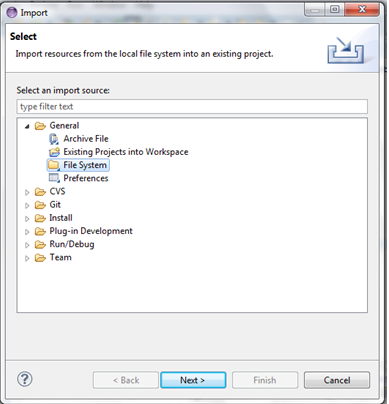
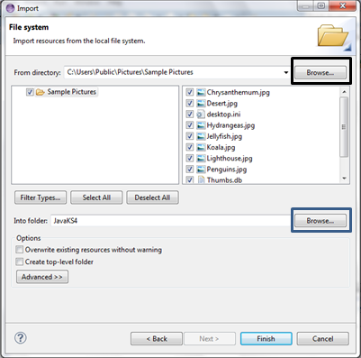
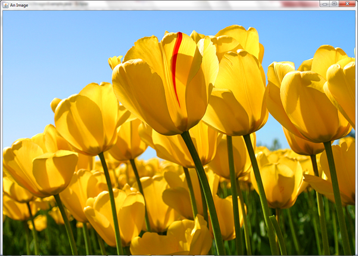

HelloWorld
===

In the last part, we created an empty window; now we want to add some text to it. We will create a class that extends the JFrame from HelloWorld just like last time, but this time our class will have a property called `label` that will be an instance of the class `JLabel`. We will also use an instance of the `FlowLayout` class to organise the elements on screen. The following imports will be needed:

```java
import java.awt.FlowLayout;
import javax.swing.JFrame;
import javax.swing.JLabel;
```

Here is the code, copy it and we'll discuss it later:

```java
public class HelloWorld extends JFrame {
    JLabel label = new JLabel("Hello World", JLabel.CENTER);

    public static void main(String[] args) {
        new HelloWorld();
    }

    public HelloWorld() {
        add(label);

        setLayout(new FlowLayout());
	    setSize(300, 70);
	    setTitle("Hello World");
	    setVisible(true);
	    setDefaultCloseOperation(EXIT_ON_CLOSE);
	}
}
```

Notice the constructor for the `JLabel`: it takes in two parameters, both of which are optional. The first is its text, the second is its alignment. We then use the `add()` method to add it to the window. Also notice how the `setLayout()` method is used to set the **layout manager** to a new instance of a `FlowLayout`. 

This should be outputted:


#### Ex 1
Play around with it. Try adding another `JLabel` with a different greeting. You may have to change the second parameter, the height parameter, of `setSize()` to fit it in. You will have to add another call to the `add()` method.

### Adding Pictures to JLabels
It may not say it outright, but this part is desgined to show you how to create something and add it to a JFrame, in particular, JLabels. But these JLabels are far more useful than just displaying a line of text. They can be changed on the push of a button, can be attached to almost anything and can display images, which is what this is about.

To set a JLabel (or a button, but you'll see that later) to contain an image, first you have to import the image into Eclipse. To do this, find an image and save it to your computer. Then, in Eclipse, click **File** in the top bar, and then click **Import**. This should give you the following screen:



Then choose your file source, which will most likely be General->File System. This will then give you this:



I have already filled this in. I have taken my pictures from the Sample Pictures folder, which I got when I clicked the Browse button (bordered in black) and followed the path Libraries->Pictures->Public Pictures->Sample Pictures. However you could store your images anywhere and find them. I then chose the folder to import them to using the **Browse** button (bordered in blue) and chose the folder JavaKS4, which is simply one of my folders.

That will import your images and make them easy to access. Now, back to the point. To create an image you use code similar to this:

```java
import javax.swing.*; // imports all of Swing.

public class ImagesExample extends JFrame {
	ImageIcon image;
	JLabel label;
	//declares an ImageIcon(which the image is defined as) and a JLabel.
	
	public imagesExample() {
		image = new ImageIcon("Tulips.jpg"); // sets the ImageIcon to be Tulips.jpg
		label = new JLabel(image); // set the JLabel to be the image.
		
		add(label);

		setSize(1024, 800);
		setVisible(true);
		setDefaultCloseOperation(EXIT_ON_CLOSE);
		setTitle("An Image");
	}
	
	public static void main(String[] args) {
		new ImagesExample();
	}
}
```
This should output the following, only it would be the size of the screen:


