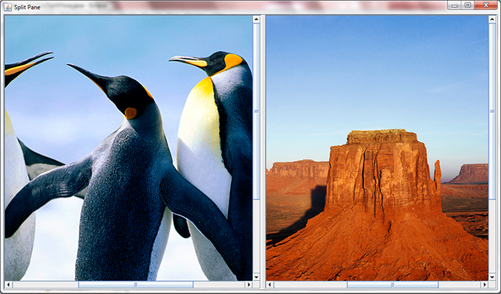
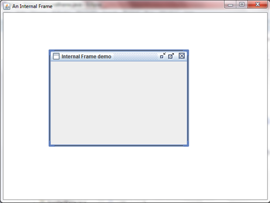
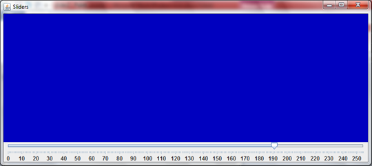
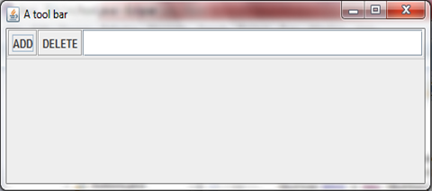

Complex Interfaces
===

## JSplitPane
You have known how to put an image onto the screen and add scroll bars to it if it is too big since part II. But, what if you want to put two images on to the screen next to each other, and want to be able to dictate just how much space each image takes up? For that purpose you can use a `JSplitPane`. This is a pane that contains two images and has a functionality with which you can change how much of the screen each image takes. To do this you will have to import `javax.swing.JSplitPane`, and will have to declare a new `JSplitPane`. Inside the parameters however, you will have to add some other things, including scroll bars (because otherwise you will not be able to dictate how much of each picture you see). The declaration will end up looking like this:

```java
JSplitPane split = new JSplitPane(JSplitPane.HORIZONTAL_SPLIT, new JScrollPane(label1), new JScrollPane(label2));
//where 'label1' and 'label2' are predeclared labels.
```

Then, in the constructor, you set those labels to be your images of choice and add the split pane to the JFrame. This particular piece of code, along with all of the other things needed for it to function, cretes this:



You could also change the `HORIZONTAL_SPLIT` to `VERTICAL_SPLIT`, but that would not be very good for our penguins health:


He seems to now have a massive mound of rock instead of a body.

## JTabbedPane
Assume you have two windows, and wish to be able to switch between them at will, because they have different pieces of information for example. To do this you could use a variety of things, but one of the better ones is a `JTabbedPane`. This is not the most useful way of doing this - it would be far more useful to use the card layout. However, I think that this looks slightly better. To use a JTabbedPane you have to declare and instantiate a `JTabbedPane`, as you would do with anything else. Then you have to create two panels and two labels (or two of what you were going to put on the tabs). Then add as many tab panes as you want. Finally, add these panels to the JTabbedPane. You do this as normal, i.e. like this:

```java
tabbedPane.add("First pane", panel1);
//where 'panel1' is the name of the panel and '"First pane"' is what will be displayed on the tabs themselves
tabbedPane.add("Second pane", panel2);
add(tabbedPane);
```

This will create the following:


### Ex 1
Create your own `JTabbedPane` with two tabs, one with a message on it and one with a button that creates a message upon clicking.

## JInternalFrame
Next on the list of random trinkets is the JInternalFrame. As the name suggests this is a fram inside of a frame, or, quite literally, an internal frame. To do this you will need the following imports:

```java
import javax.swing.JDesktopPane;
import javax.swing.JFrame;
import javax.swing.JInternalFrame;
```

You need JFrame and JInternalFrame for obvious reasons, and you need the DesktopPane for reasons that you need not delve in to. Be satisfied with the knowledge that it is necessary. To set up your internal frame, you will have to extends your JFrame as usual and then declare a DesktopPane and a JInternalFrame, with the parameters for the JInternalFrame containing the title of the internal frame. Then, inside the constructor use the following code, where 'frame' is the identifier of the JInternalFrame and 'desktop' is the identifier of, you guessed it, the DesktopPane:

```java
frame.setSize(320,240);
frame.setVisible(true);

frame.setMaximizable(true);;
//can be maximised
frame.setIconifiable(true);
//can be reduced to an icon
frame.setResizable(true);
//can be resized
frame.setClosable(true);
//can be shut down
frame.setDefaultCloseOperation(DISPOSE_ON_CLOSE);

desktop.add(frame);
add(desktop);
```

Set up the main JFrame as usual and you can get something like this:



As a point of reference, if you were to not use the code from `setMaximizable` to `setClosable`, you would get the following:


## JSlider
So, in the part labelled 'Listeners', the ChangeListener was explained in the context of JSliders. Now, you will find out how to make them. A JSlider is exactly what you think it is, and needs to be added to a JFrame, which I shouldn't have to tell you to extend by now. This is an example of declaring a JSlider:

```java
JSlider slide = new JSlider(JSlider.HORIZONTAL, 0, 255, 0);
```

The contents of the parameters are necessary for this component. The HORIZONTAL refers to the positioning of the slider i.e. horizontally or vertically. The first 0 dictates the number the slider starts at and the 255 is the number the slider ends at. The second 0 dicates where the pointer will be when you start the program. And that's pretty much it, adding that to a JFrame will create a slider. You can however further customise the slider. Including the following code in the constructor will change the slider:

```java
slide.setMajorTickSpacing(10);
//every big number comes along every 10.
slide.setMinorTickSpacing(1);
//every small number is shown every 1.
slide.setPaintLabels(true);
//creates the numbers.
slide.setPaintTicks(true);
//creates the lines
```

These sliders can be added to ChangeListeners and you can create something like the following which changes the colour of a label based on the value of the slider:




## JToolBar
A useful toll is the JToolBar. It is exactly what it says on the tin, it is a toolbar which can have various components put onto it. To create a JToolBar you have to declare and instantiate it as usual. The, inside the main constructor, you add components to the toolbar. Bear in mind that this is position-sensitive - if you add a button, then a text field then a label, then the button will be on the left, then the text field, then the label on the right. You can therefore make something like the following:


As you will notice from the pictures, you can move this toolbar about by default and even separate it from the frame it is in. This may not be preferable however, so you can naturally stop this. To do so just add this to your constructor: 

```java
tools.setFloatable(false);
//where 'tools' is the name of the toolbar
```

Using that, the following would be outputted:



Finally you can separate the components in a JToolbar using the following code:

```java
tools.addSeparator();
```

Bear in mind that this is position sensitive, so you place this inbetween the additions of the two components you want to separate. The following is therefore possible:


## JMenu
The title of this portion is not strictly correct, because this covers three things, the `JMenuBar`, the `JMenu` and the `JMenuItem`. However these all coalesce into one menu. What I mean by menu is the bar at the very top of the screen when you enter Eclipse or Microsoft Word i.e the bar that contains File and Edit and Help etc. To do this you will first need to declare and instantiate a new JMenuBar. Then in the constructor you need the following:

```java
	setJMenuBar(menu);
	//where 'menu' is the name of the JMenuBar
	```
	
This sets the menubar up, but it currently has nothing in it. So, you need to add JMenus. These are the actual buttons that you click in order to display the drop-down. To do this you need to declare JMenus and name them, then add them to the JMenuBar. As if you need a reminder, this is how you would do it:

```java
JMenu file = new JMenu("File");
JMenu edit = new JMenu("Edit");

menu.add(file);
menu.add(edit);
```

This would create the following, but notice the lack of items, that is our next job:


The items are easy to add, as you shall see. You simply create a JMenuItem, name it like you did with a JMenu and then add it to the respective JMenu. Bear in mind that, once again, it is position-sensitive, so you have to add them in order. If you want the line between the items that you see in most menus, just include this:

```java
component.addSeparator();
```

As you did with the toolbar. Once again, put it in the right place. So, if you have followed me, you could create something like this, which I have unashamedly copied from Eclipse's menu itself:


