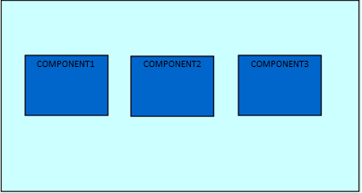
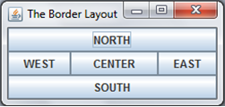
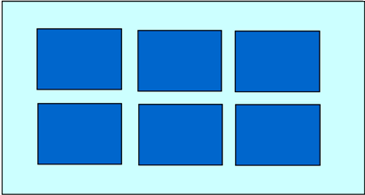

Layouts
===

Basically, a **layout manager** is a way of presenting and displaying the elements of either a frame or a panel. In other words: layouts allow you to tell the computer where you want to display your different objects and in what order. As we have seen previously, you  apply the layouts to a frame. In Java, there exists three different types of layouts: the grid layout, the flow layout and the border layout.

## The Flow Layout
Flow Layout, which is the only layout manager you have seen before, is the simplest layout you can choose because it arranges the components one after another, going from left to right, in the order in which you add them.

```java
import java.awt.FlowLayout;
//you will have to do this for the other layouts using their respective imports

import javax.swing.JButton;
import javax.swing.JFrame;

public class FloLayout extends JFrame{
	JButton btn1 = new JButton("Component 1");
	JButton btn2 = new JButton("Component 2");
	JButton btn3 = new JButton("Component 3");
	
	public FloLayout() {
		setLayout(new FlowLayout());
		add(btn1);
		add(btn2);
		add(btn3);
		
		setTitle("The Flow Layout");
		setDefaultCloseOperation(EXIT_ON_CLOSE);
		pack();
		//makes sure that the window is as big as the space taken up by the buttons 
		setVisible(true);
	}
	
	public static void main(String[] args) {
		new FloLayout();
	}
}

```

This displays elements of a frame so that `component1` (which has already been initialised) comes before `component2` (which has also been initialised). It should therefore look something like this:



###Ex 1
Create a frame using three buttons that are oriented using the flow layout. Use the syntax above. It should therefore look like this:


## The Border Layout


A border layout allows you to place your elements into five different regions as shown above. You can use relatively the same code as you did for the flow layout, but bear in mind that you must give the component the name NORTH, SOUTH etc.  

```java
//this is what the buttons should look like, respective of their positions
JButton component1 = new JButton("NORTH");

setLayout(new BorderLayout());
add(component1, BorderLayout.NORTH);
add(component2, BorderLayout.SOUTH);
add(component3, BorderLayout.EAST);
add(component4, BorderLayout.WEST);
add(component5, BorderLayout.CENTER);
```

###Ex 2
Create a frame with five buttons that are oriented using the border layout. You will have to do this yourself. For reference however, the end product should look like this:



##The Grid Layout
A Grid Layout arranges the components into a two dimensional grid with a number of rows and columns.

```java
setLayout(new GridLayout(2, 3));
// the different values are as follows: number of rows; and number of columns.
```

OR

```java
setLayout(new GridLayout(2, 3, 3, 5));
// the different values are as follows: number of rows; number of columns; horizontal padding and vertical padding.
```

This creates a layout with two rows and three columns as seen below:



###Ex 3
Create a frame with six buttons that are oriented using the grid layout. You will once again have to do this yourself. This is what the end product should look like:


