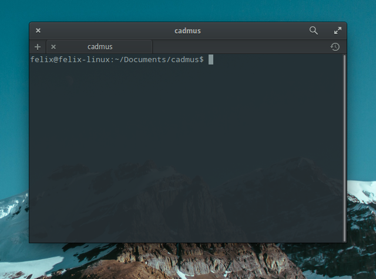
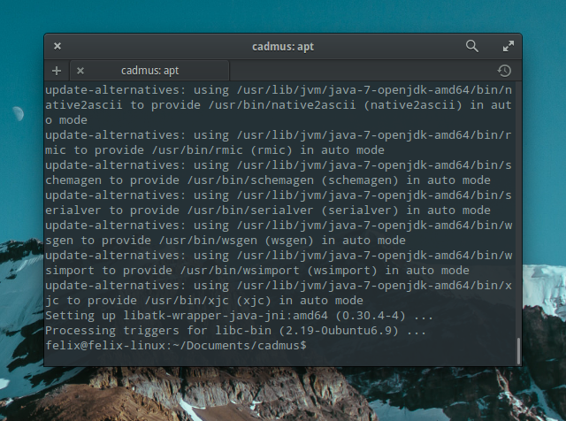
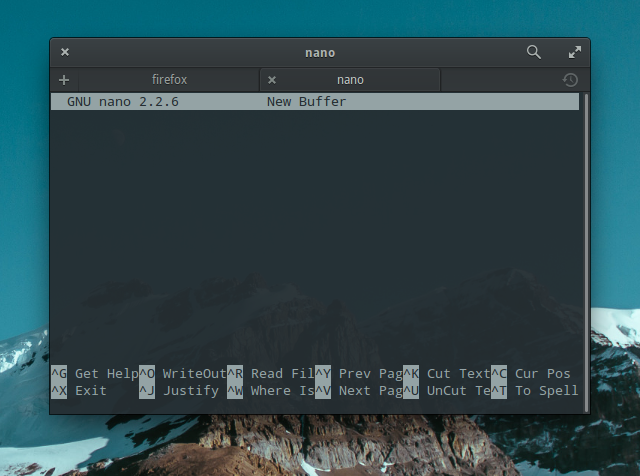
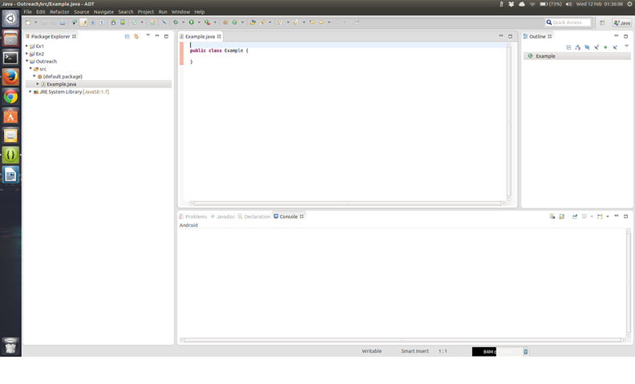

xx
Installing Java SDK
===

In this course we will be using Linux and writing our Java in a simple text editor. Unix, such as OS X, should be similar but it is up to you to support that. This will cover instructions for Debian Linux, which includes Ubuntu, because if you're using another distro you're probably good enough to know how to install stuff. If you run Windows, I recommend running a virtual machine, in VirtualBox, but if you run Windows 10 Developer Preview, you can enable a bash console. In this we will assume that you understand and can use bash. If not, I recommend [this tutorial](http://cli.learncodethehardway.org/book/) or [this CodeCademy guide](https://www.codecademy.com/learn/learn-the-command-line).

##So now we will cover how to install the thing:
First, we need to open up our terminal, using Win+T or Ctrl+Alt+T on most distros:



Next (on Debian based distros) we need to enter the command

```bash
sudo apt install openjdk-7-jdk -y
```

You will be prompted for your user password. Type it in and then it should install:



##How we'll write out Java
We are going to use a lowly text editor for this tutorial. While IDEs have advantages, it is always best to learn on a text editor, otherwise you become reliant on IDE help tools ([see this explanation](http://c.learncodethehardway.org/book/ex0.html#warning-do-not-use-an-ide)). I personally recommend [Atom](http://atom.io), or for the minimalists, Nano, but Gedit and Vim are just fine.

## What this course entails
In this course you will learn how to program in Java and then Swing.  You can think of programming as a way of making your computer do things - and anything that you create and run on your computer is called a program.  Programs can be seen as a set of instructions that get executed when you run the program. The instructions for programs cannot be written in plain English; they must be written in different languages, one of which is Java.  Anything you write in Java is called code, and lines of code look very similar to sentences.  However there are some key differences, such as that lines of code end in a semi-colon (;) not a full-stop. Eclipse is very nice and will highlight different bits of your code so that you can see the different bits of code more clearly. The code you write in Eclipse will tell your program what you want it to do when you run your code.  With that explained, on with the programming!

1) Open up your text editor (we will use Nano):
Open a terminal how we showed you earlier, and enter `nano`. It should look something like the screen shot below:



The green icon, which looks like the picture below, is used to run your programs. It can be found in the top bar and you have to click it to run the current program you are working in. Provided that your program has no errors, your program should run.


Click on File->New->Java Project. Call the project name "cadmus" and click "Finish". Now right-click "cadmus" in the sidebar, then click New->Class and you should see the following pop-up:


Where it says name type in Example then click Finish, and so your screen should look like this:


Notice the words `public class` in purple.  A class is a file which contains objects and methods (which you will see in Chapter II). The word `public` just means that the piece of code can be used in other classes. The other word that we could have written in that space is `private`, so that only the class that we are currently in can use the piece of code.

At the top of a Java program, usually you can find a comment or two stating the name of the person who wrote the program and a note on what the program does.  To write words and sentences in a program that other people can see when they look at your code, but isn't visible to the computer when you run your program, write `//` at the start of the sentence you want to write.  So, I would write:

```java
// By Agent X; this is an example program.
```

This is to let other people who view my program know that the code was written by me, and likewise you would write your own name and the purpose of your program.

Now copy and paste this piece of code into your class:

```java
public static void main(String[] args) {

}
```

This is the main method, and every Java program needs a main method.  It is the first bit of code your program looks at when it is run.  If you have more than one main method, your program will get confused and will not know what to do.  (Where should it be starting from? This main method or that one?) So, the point is, you can only have ONE main method per program. You can run other methods from the main method too.  The main method must always begin with that line and the file should look like the last screenshot.  Bear in mind that you cannot change the name of the main method or not use one, and you must also keep the class name the same once you make the class (i.e. once you call your class 'Example' you cannot change that). By the end of your course, you will have seen the main method so many times you'll be able to memorise it.

[Write your first computer program: Hello World &rarr;](./Part-II:-Printing.html)
