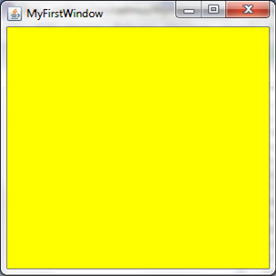

MyFirstWindow
===

Chapter 4 is all about Java Swing. To make your first GUI (graphical user interface) application you need to import the package `javax.swing.JFrame`. Here is an example of an empty window:

```java
public class MyFirstWindow extends JFrame {
  public static void main(String[] args) {
    new MyFirstWindow();
  } 
  public MyFirstWindow() {
    setSize(300, 300);
    setTitle("MyFirstWindow");
    setVisible(true);
    setDefaultCloseOperation(EXIT_ON_CLOSE);
    setLocationRelativeTo(null);
    //this one is not necessary, but places the JFrame in the middle of the screen
  }
}
```

Here, the class `MyFirstWindow` inherits, thanks to the `extends` keyword, all of properties and methods of the `JFrame`. That means an object of a `MyFirstWindow` is also, in essense, and object of `JFrame`. But what is `JFrame`? A JFrame is one of the main JComponents in Java Swing, and you will be using it for all of your GUIs. And, just as a frame of reference, a JComponent is another, more scientific, way of saying every component you will ever use. The difference is in the custom methods of `MyFirstWindow` such as the constructor, where the title, size, and visibility are set. You may say that `setTitle`, `setSize`, and `setVisible` do not exist, but they are extended `JFrame` methods. `setDefaultCloseOperation(EXIT_ON_CLOSE)`, meanwhile just ensures that the Java app doesn't lay running hidden in the background.

The code above should output this when run:


## Colouring these Windows
These windows are not limited to a dull, boring grey, in fact these windows can be set to pretty much any colour under the Sun. To do this you will have to import `Color`, using the import:

```java
import java.awt.Color;
```

To use this import you will have to use the following syntax:

```java
getContentPane().setBackground(Color.YELLOW);
// this will create a yellow window, however you can replace this with other colours.
```

As you can see, you can change the colour of your background using the method `setBackground(Colour)`. There are wide range of existing colours like:

Color.PINK, Color.GREEN, Color.BLACK, Color.Yellow, Color.BLUE, Color.RED, Color.WHITE, Color.CYAN, Color.ORANGE

N.B. American spellings apply here.

This particular piece of code would putput the following:



### Ex 1
Copy & run the code. Play around with `setSize`, `setTitle`, `setVisible` and `setBackground()`.

### Ex 2
Research the `setResizable()` method and create another window called `MySecondWindow` which cannot be resized.
HINT: You don't actually need to research it, it either can or cannot be resized (think about how `setVisible` works).

# JPanels
The thing we just did used frames, but a frame is the entire space taken up by the program. But what if you want to put many different thing on one frame in various different places. To so this you can use fancy layouts (which I will mention later) but you could also use the `JPanel`. A JPanel can be seen as a "mini-frame". In most ways, these panels work the same as frames, and can do the same things as frames. They also work the same as most components (which you haven't met any of yet). Therefore you can add them to the frame, colour them, resize them etc. A JPanel has to be declared and initialised, which you do as follows:

```java
JPanel panel = new JPanel();
//where 'panel' is the name of the JPanel, for later use. The name 'panel' is not necessary; you could call it anything.
```

As another point, you will need to import `javax.swing.JPanel`. Then you have to actually add the panel to the frame, which you do as follows:

```java
add(panel);
```

Once the panel has been added to the frame, you can use it as a smaller frame. As I said, you can add things to it, recolour it and resize it, to name a few things. For example, copy this code and see what you get (if you do not understand what the code means, do not worry, as it will all be explained in time):

```java
public class panels extends JFrame {
	JPanel panel1  = new JPanel();
	JPanel panel2 = new JPanel();
	JPanel panel3 = new JPanel();
	JLabel message1 = new JLabel("Hello from panel1");
	JLabel message2 = new JLabel("Hello from panel2");
	JLabel message3 = new JLabel("Hello from panel3");
	
	public panels() {
		setTitle("JPanels");
		setSize(1000,1000);
		setLayout(new GridLayout(1,3));
		setDefaultCloseOperation(EXIT_ON_CLOSE);
		setVisible(true);

		panel1.setBackground(Color.CYAN);
		panel1.add(message1);
		// this is adding message1 to panel1.
		add(panel1);
		
		panel2.setBackground(Color.PINK);
		panel2.add(message2);
		add(panel2);
		
		panel3.setBackground(Color.GREEN);
		panel3.add(message3);
		add(panel3);

	}
	
	public static void main(String[] args) {
		new panels();
	}
}
```

You will also need to import `java.awt.GridLayout` and `javax.swing.JLabel`. But that is not all - as I've mentioned many a time you can customise these panels. Once again if you don't understand this code, don't worry:

```java
public class panels extends JFrame{
	JPanel panel1  = new JPanel();
	JPanel panel2 = new JPanel();
	JPanel panel3 = new JPanel();
	JPanel panel3one = new JPanel();
	JPanel panel3two = new JPanel();
	JLabel message1 = new JLabel("Hello from panel1");
	JLabel message2 = new JLabel("Hello from panel2");
	JLabel message3 = new JLabel("Hello from panel3");
	JLabel atext = new JLabel("I am a panel inside a panel");
	
	public panels() {
		setTitle("JPanels");
		setSize(1000,1000);
		setLayout(new GridLayout(1,3));
		setDefaultCloseOperation(EXIT_ON_CLOSE);
		setVisible(true);

		panel1.setBackground(Color.CYAN);
		panel1.add(message1);
		add(panel1);
		
		panel2.setBackground(Color.PINK);
		panel2.add(message2);
		add(panel2);
		
		panel3.setLayout(new GridLayout(1,2));
		
		panel3one.setBackground(Color.WHITE);
		panel3one.add(atext);
		
		panel3two.setBackground(Color.YELLOW);
		
		panel3.add(panel3one);
		panel3.add(panel3two);
		
		add(panel3);

	}
	
	public static void main(String[] args) {
		new panels();
	}
}
```

[Well that's nice, but what can you put in these frames and panels? &rarr;](./Part II: HelloWorld.html)
