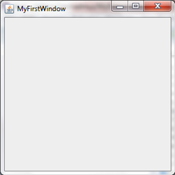

MyFirstWindow
===

Chapter 2 is all about Graphics. To make your first GUI (graphical user interface) application you need to import the package `javax.swing.JFrame`. Here is an example of an empty window:

```java
public class MyFirstWindow extends JFrame {
  public static void main(String[] args) {
    new MyFirstWindow();
  } 
  public MyFirstWindow() {
    setSize(300, 300);
    setTitle("MyFirstWindow");
    setVisible(true);
    setDefaultCloseOperation(EXIT_ON_CLOSE);
  }
}
```

Here, the class `MyFirstWindow` inherits, thanks to the `extends` keyword, all of properties and methods of the `JFrame`. That means an object of a `MyFirstWindow` is also, in essense, and object of `JFrame`. The difference is in the custom methods of `MyFirstWindow` such as the constructor, where the title, size, and visibility are set. You may say that `setTitle`, `setSize`, and `setVisible` do not exist, but they are extended `JFrame` methods. `setDefaultCloseOperation(EXIT_ON_CLOSE)`, meanwhile just ensures that the Java app doesn't lay running hidden in the background.

The code above should output this when run:



## Colouring these Windows
These windows are not limited to a dull, boring grey, in fact these windows can be set to pretty much any colour under the Sun. To do this you will have to import `Color`, using the import:

```java
import java.awt.Color;
```

To use this import you will have to use the following syntax:

```java
getContentPane().setBackground(Color.YELLOW);
// this will create a yellow window, however you can replace this with other colours.
```

As you can see, you can change the colour of your background using the method `setBackground(Colour)`. There are wide range of existing colours like:

Color.PINK, Color.GREEN, Color.BLACK, Color.Yellow, Color.BLUE, Color.RED, Color.WHITE, Color.CYAN, Color.ORANGE

N.B. American spellings apply here.

This particular piece of code would putput the following:


### Ex 1
Copy & run the code. Play around with `setSize`, `setTitle`, `setVisible` and `setBackground()`.

### Ex 2
Research the `setResizable()` method and create another window called `MySecondWindow` which cannot be resized.
HINT: You don't actually need to research it, it either can or cannot be resized.
