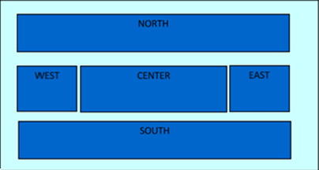
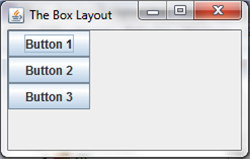
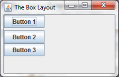
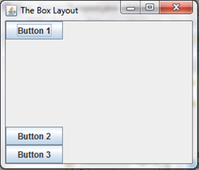

Layouts
===

Basically, a **layout manager** is a way of presenting and displaying the elements of either a frame or a panel. In other words, layouts allow you to tell the computer where you want to display your different objects and in what order. As we have seen previously, you  apply the layouts to a frame. In Java, there exists many different types of layouts, four of which are: the grid layout, the flow layout, the box layout and the border layout.

## The Flow Layout
Flow Layout, which is the only layout manager you have seen before, is the simplest layout you can choose because it arranges the components one after another, going from left to right, in the order in which you add them.

```java
import java.awt.*;
import javax.swing.*;

public class FloLayout extends JFrame {
	JButton btn1 = new JButton("Component 1");
	JButton btn2 = new JButton("Component 2");
	JButton btn3 = new JButton("Component 3");

	public FloLayout() {
		setLayout(new FlowLayout());
		add(btn1);
		add(btn2);
		add(btn3);

		setTitle("The Flow Layout");
		setDefaultCloseOperation(EXIT_ON_CLOSE);
		pack();
		//makes sure that the window is as big as the space taken up by the buttons
		setVisible(true);
	}

	public static void main(String[] args) {
		new FloLayout();
	}
}

```

This displays elements of a frame so that `component1` (which has already been initialised) comes before `component2` (which has also been initialised). It should therefore look something like this:


### Ex 1
Create a frame using three buttons that are oriented using the flow layout. Use the syntax above. It should therefore look like this:


## The Border Layout



A border layout allows you to place your elements into five different regions as shown above. You can use relatively the same code as you did for the flow layout, but bear in mind that you must give the component the name NORTH, SOUTH etc.  

```java
//this is what the buttons should look like, respective of their positions
JButton component1 = new JButton("NORTH");

setLayout(new BorderLayout());
add(component1, BorderLayout.NORTH);
add(component2, BorderLayout.SOUTH);
add(component3, BorderLayout.EAST);
add(component4, BorderLayout.WEST);
add(component5, BorderLayout.CENTER);
```

### Ex 2
Create a frame with five buttons that are oriented using the border layout. You will have to do this yourself. For reference however, the end product should look like this:


## The Grid Layout
A Grid Layout arranges the components into a two dimensional grid with a number of rows and columns.

```java
setLayout(new GridLayout(2, 3));
// the different values are as follows: number of rows; and number of columns.
```

OR

```java
setLayout(new GridLayout(2, 3, 3, 5));
// the different values are as follows: number of rows; number of columns; horizontal padding and vertical padding.
```

This creates a layout with two rows and three columns as seen below:


### Ex 3
Create a frame with six buttons that are oriented using the grid layout. You will once again have to do this yourself. This is what the end product should look like:


### Ex 4: Tic-Tac-Toe
Create a game of tic-tac-toe, where a human plays against a computer. Use the code from the last exercise to create a 3x3 grid of buttons. Set the height and width of the frame to be identical, so the height and width of the buttons are identical. The buttons should contain no text until they are clicked. When they are clicked they should change to X, and the button should be disabled (using the `setEnabled()` method). Then the computer takes its turn, and selects an (empty) button, turning its contents to O. Then the human goes again until either the person or the computer wins (or there is a draw), at which point use `JOptionPane` to display a message and disable all buttons.

To create the artifical intelligence i.e. to calculate what the computer does, use the following algorithm:
1. If the centre button is empty, the computer selects it.
2. Otherwise the computer checks the corner buttons in turn, to see if any of them are empty. If it finds an empty button, it selects it.
3. Otherwise it checks all the other buttons to find an empty button to select.
4. If there are no empty buttons, then it is a draw and a message is displayed announcing the draw.

## The Box Layout
The Box Layout us basically a better flow layout, because the flow layout allows for horizontal alignment of components whereas the box layout allows for that, horizontally aligned components and a better manipulation of these components. To use this layout you will need a panel and some buttons, or other components. You then have to use the following code:

```java
panel.setLayout(new BoxLayout(panel, BoxLayout.PAGE_AXIS));
//where panel is the name of a JPanel
panel.add(btn1);
panel.add(btn2);
panel.add(btn3);
add(panel);
```

The first line is the important one when using the Box Layout. You set the layout to the panel, as with all the others, but the contents of the parameters is what's important. The first word is the parent component i.e. the panel. Then the `BoxLayout.PAGE_AXIS` sets the components to be aligned vertically, which is one of the reasons the box layout is better than the flow layout. However if you do want to align the components horizontally, you just replace `PAGE_AXIS` with `LINE_AXIS`. Anyway, using the code above, you create something like this:



But this is not the extent of the box layout. The first thing that we can do is separate the components. To do this you have to use the following code:

```java
panel.add(Box.createRigidArea(new Dimension(0,5)));
```

This will separate the two components that it is placed in between with a gap of '5', which can be interpreted as 5px. This is created by the `new Dimension(0,5)`, which would be replaced by `new Dimension(5,0)` if you were using the `LINE_AXIS`. The separation looks like this:



One final thing that you can do with the box layout is 'glue' the components to the top or bottom of the frame. To use this you will need the following:

```java
panel.add(Box.createVerticalGlue());
```

This is placed between the first and second button, and it is a vertical glue, which, quite literally, glues everything after the first button to the bottom. If you wanted to use this with a `LINE_AXIS` then you will simply have to use this:

```java
panel.add(Box.createHorizontalGlue());
```

The vertical glue will create the following layout:



[We've made passing mentions, but now it's time to study JTextFields in full &rarr;](./Part-VI:-Text-Fields.html)
