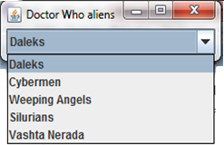
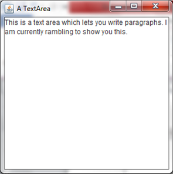

Text Fields
===

In Java there are are 3 main types of text field - the normal textfield, the password field and the drop-down menu. What these are and how they work will be explained in this chapter. As an introduction, if there is any doubt as to what a text field is, a text field is a box that lets the user input a small amount of text. As a passing statement, these textfields interact with the layouts introduced in that last part just as buttons do.

## JTextField
You already know what a standard `JTextField` is. There several constructors for a JTextField. You can pass in a string, which will be the default text. You can pass in a number which will be the width. Or you can pass in both.

```java
JTextField normal = new JTextField("Your word here", 15);
```

This would output the following:


You can also make these text fields uneditable:

```java
normal.setEditable(false);
//where 'normal' is the identifier of the text field
```

The following would be outputted if this is combined with the other pieces of code:


Finally, you can colour your text fields. I'm not going to give an example of this because the code is identical to how you would colour a JFrame, only you don't have to include the `getContentPane()`. If you were to colour your text field orange, then it would look like this:


### Ex 1
Create your own text field and run it. Try to input some text. If you wish, put an integer into line 5 to dictate the size of the text field. You could also make the text field uneditable, if you so desire.

## JPasswordField
Whenever you have to enter a password into a website, what you type in is obscured by black dots. This is a result of the password field. To create this you just have to replace `JTextField` with `JPasswordField`.

### Ex 2
Create a password field and see what happens when you try to type something in. Your finished product should look something like this:


## JComboBox
A JComboBox, otherwise known as a drop-down menu, is a text field that lets you choose from a preset list of options that, quite literally, drop down when you click a button. To use this you will have to declare an array which includes all of the options. You can see how to declare an array in Chapter 1 Part V. You will then have to put the name of the array in the parameters that the `JComboBox` has. In other words:

```java
JComboBox DoctorWho = new JComboBox(monsters);
//where 'monsters' is the name of a String array.
```

### Ex 3
Create a drop-down menu with 5 different options. It does not have to be about Doctor Who and/or monsters. Your end result should look something like this (bear in mind that I've used aliens from Doctor Who):



## JSpinner
This is not strictly a text field, however it is a form of user input, which is all a text field is. Besides, a JComboBox is also not a text field. Onto the matter at hand. The JSpinner is what you use to cycle through values, usually numbers. To create one you will need to declare and instantiate a JSpinner. This will create a basic spinner like the following:


You can type in any number to this spinner and cycle through any number (positive and negative). But, if you make this or are particularly observant you will see that any two digit number will not fit. To fix this you will need to use Dimensions, which are basically ways of saving the sizes of components:

```java
Dimension a = spin1.getPreferredSize();
//creates a Dimension and gets the preferred size of the spinner (the preferred size is the natural size of the component)
a.width = 50;
//sets the width of a to be 50
spin1.setPreferredSize(a);
//sets the preferred size of the spinner to a i.e. 50
```

This will create the following, and you will see that the numbers now fit:


But this is not all you can do with spinners. This spinner literally just counts numbers, but what if you want to do things like set boundaries? In that case, you actually have to fill out the paramemters of the JSpinner when you declare it. You do so as follows:

```java
spin2 = new JSpinner(new SpinnerNumberModel(1, 1, 100, 1));
//better spinner -> 1 is the starting value, 1 is minimum value, 100 is maximum value and 1 is incremental value
```

This one simply serves to cap the value at 100. Therefore, no picture is necessary. Now, what if you wanted to put something other than numbers into the spinner? First you will need to know what you want to put into the spinner, and I'm going to use days of the week. To do this you will need an array of the values, and then you will need to use the following code:

```java
spin3 = new JSpinner(new SpinnerListModel(days));
//where 'days' is the name of a String array containing the days of the week
```

The `SpinnerListModel` is need for that to work, as opposed to `SpinnerNumberModel`. So, doing that will create the following:


The final thing I want to tell you about including JSpinners is how to make one that cycles through the date. To do this you will need to import both `Date` and `Calendar`. Then you copy out the following code and you have created a date-cycling spinner:

```java
import java.util.*; // (includes java.util.Date and java.util.Calendar)
```

```java
Date todaysDate = new Date();
//gets today's date

spin4 = new JSpinner(new SpinnerDateModel(todaysDate, null, null, Calendar.DAY_OF_MONTH));
//'Calendar.DAY_OF_MONTH' is required, and while both DAY_OF_WEEK and DAY_OF_YEAR could be used, DAY_OF_MONTH is best
JSpinner.DateEditor dateEditor = new JSpinner.DateEditor(spin4, "dd/MM/yy");
//edits the date as you spin it
spin4.setEditor(dateEditor);
//sets the spinner's editor to be the date editor just created
```

This will create the following:


As a final note, the JSpinner works with ChangeListener, which you will find in Chapter V.

## Accepting and using user input
It's all very well having a text field on your screen, but it has no purpose if you cannot use what the user has inputted. Therefore for your text field to be fully working, you need to be able to accept and use these inputs. There are two main ways to do this, one using the above formats of text field; and one which uses a whole new format i.e. The `JOptionPane`. I will explain both of these in detail shortly.

## Using a JTextField
It can be very easy to store a user's input and manipulate it, for example you can display the user's input on the screen. To do this, all you really need to do is set a variable to be the input, and then set a label to be that variable. In other words, you can use the following code inside the actionPerformed method:

```java
public void actionPerformed(ActionEvent evt) {
	    String text = normal.getText();
	    label.setText(text);
	    //where label is the name of a JLabel
	}
```

Add this to a button, text field and a label, and you can create something like the following:


This simply displays the user's input, but since `normal.getText()` stores the user's input, you could just as easily validate or manipulate the input.

### Ex 4
Convert your code to work with a password field - What is outputted?
See what happens with other text fields, or try to manipulate the user's input.

## Using a JOptionPane
You have already met the `JOptionPane`. To create a JOptionPane for input you simply need to declare a variable e.g. `width` and then type this in:

```java
String width = JOptionPane.showInputDialog("Width", "Enter the width");
//the first parameter is the title and the second is the background text.
```

This will create a pane, you don't have to add it, and it stores the input as soon as the OK button is pressed. For that matter, it comes pre-styled and with its own buttons. Whereas you would have to set a title; set the frame to be visible; set a DefaultCloseOperation etc with a JTextField, you don't have to do any of that with JOptionPanes. You can therefore use these easily. To work out the area of a rectangle based on the inputs the user gives using a JOptionPane can be done with this code:

```java
public static void main(String[] args) {
	String width = JOptionPane.showInputDialog("Rectangle Width", "Enter the width of your rectangle");
	//sets a variable to be the width

	String height = JOptionPane.showInputDialog("Rectangle Height", "Enter the height of your rectangle");
	//sets a variable to be the height

	int area = Integer.parseInt(width) * Integer.parseInt(height);
	//converts the strings into ints and works out the area

	String answer = "The area is " + area + "cm²";
	//sets a variable to be what the JOptionPane will output

	JOptionPane.showMessageDialog(null, answer, "The Area", JOptionPane.INFORMATION_MESSAGE);
	// sets what the JOptionPane will output
	// null is needed
	// answer is the variable; "The Area" is the title and the final part is the image shown (see example)

	System.exit(0); //Closes the Pane on exit.
}
```

This will create three JOptionPanes; the first two will store the variables and the last will act on those variables. This particular piece of code outputs the following:


### Ex 5
Look what happens when you change `INFORMATION_MESSAGE` to `ERROR_MESSAGE`, `PLAIN_MESSAGE`, `QUESTION_MESSAGE` and/or `WARNING_MESSAGE`.

### Ex 6
Write a program using JOptionPanes to outputs a person's full name. Have the user input enter their first name, their middle name and their family name. If they don't have a middle name, leave that pane empty.

### Ex 7
Write a program using JOptionPanes to work out the area and circumference of a circle with the radius having been inputted. HINT: the area of a circle is πr² (π is 3.14) and the circumference is 2πr.

## JTextArea
A textfield is all well and good, but there is a limited amount of space that you can write in. Therefore writing a paragraph is impossible. For that reason, there exists `JTextAreas`. These are simply huge textfields. To use these you therefore declare and instantiate the area as before:
```java
JTextArea area = new JTextArea();
```
And then, in the method, you have to use this:

```java
setPreferredSize(new Dimension(300, 300));
//This is preferrable to setSize because it sets the text area to be that size upon runnning.
```

This will create a functioning JTextArea (if you combine it with other things of course), like the one below:



### Ex 8
Create your own text are and write something extended into it.

### Ex 9
These text areas are better than text fields, but one major problem is that they have no borders. In other words you can continue writing off of the page and not be able to access it. Create another text area, only this time include scroll bars. In Part II, we showed you how to use images with scroll bars; here it works the same. Simply set the JScrollPane to be the name of the JTextArea and then add the JScrollPane.

[si vis pacem, para bellum &rarr;](./Part-VII:-Exercises.html)
