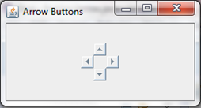

Extra Things
===

This part is exclusively for those parts of Java that cannot be fitted into anywhere else. This is a safe haven for such pieces of code, but that doesn't change the fact that they can at times be completely unecessary. Nevertheless, they have a right to be documented, and they will be here.

## Cursor
`Cursor` simply sets the cursor you are using to be a default shape, or a custom shape if you so wish. Bear in ming that there will be no pictures here because you don't actually see my cursor. As a result it is completely pointless to look at a button and not be able to see the use. Anyway, you can change a cursor in the following way:

```java
setCursor(Cursor.getPredefinedCursor(Cursor.WAIT_CURSOR));
```

Bear in mind that `WAIT_CURSOR` is not the only cursor form. Oracle are kind enough to supply more predefined ones that that. Here is a list of them (this is not exhaustive, but is close):

- CROSSHAIR_CURSOR
- DEFAULT_CURSOR
- E_RESIZE_CURSOR
- HAND_CURSOR
- MOVE_CURSOR
- N_RESIZE_CURSOR
- NE_RESIZE_CURSOR
- NW_RESIZE_CURSOR
- S_RESIZE_CURSOR
- SE_RESIZE_CURSOR
- SW_RESIZE_CURSOR
- TEXT_CURSOR
- W_RESIZE_CURSOR
- WAIT_CURSOR

Just in case you are worried about it permanently changing your cursor - it only lasts for when your cursor is hovering over the JFrame, so changes back when you mouse out of the frame. It also only lasts while the program is running.

## Arrow Buttons
In many games there are buttons with arrows on them that usually signify which direction the game character will move upon pressing. These buttons are also available in Java Swing. To use these you will need to import something we haven't used so far: `javax.swing.plaf.basic`. It is up to you whether you import the entire library by using `.*` at the end or just `BasicArrowButton` itself, but you will need one of them. In my experience, it is always better to import the whole library. Anyway, these buttons are different to normal buttons as in they don't need to be declared and instantiated before adding. You do it all as one. To add a arrow button to an inherited JFrame, you do the following:

```java
add(new BasicArrowButton(BasicArrowButton.NORTH));
```

That is all pretty self-explanatory, but bear in mind that `BasicArrowButton.NORTH` creates a up-facing arrow, as `WEST` would create a right-facing one. The next image is an example of all 4 of them used together. I have made these in such a way as to make them look like they would in a game:


